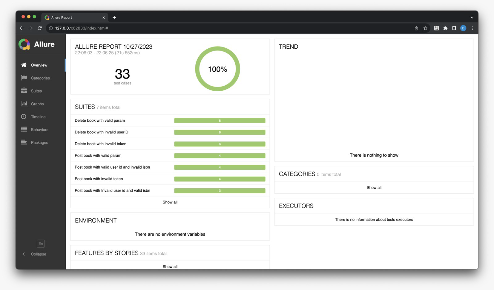

# WebDriverIO Page Objects And API Automation Demo

## Introduction
WebDriverIO is Javascript based test automation framework built over nodeJs. It is an open-source project developed for the automation testing community. WebDriverIO is extendible, compatible, feature-rich, and easy to install.

Here in this demo project, I have added the [Axios](https://github.com/axios/axios) library, in order to support API automation too.

## How to use?

**Pre-requisites:**
1. [Node.js](http://nodejs.org/)
* Install at least v12.16.1 or higher as this is the oldest active LTS version.
* Only releases that are or will become an LTS release are officially supported.
2. [VSCode](https://code.visualstudio.com/download)
3. [Allure](https://docs.qameta.io/allure/#_installing_a_commandline)

**Steps:**
1. Clone this project.
2. Open the project in VSCode.
3. Open the terminal in VSCode.
4. Execute ***`npm install`*** to install the node modules.
5. Execute ***`npm run test`*** to run the tests.
6. Execute ***`npm run report`*** to generate allure report with videos attached in failure tests.

## References
* [WebDriverIO Official Documentation](https://webdriver.io/docs/gettingstarted.html)